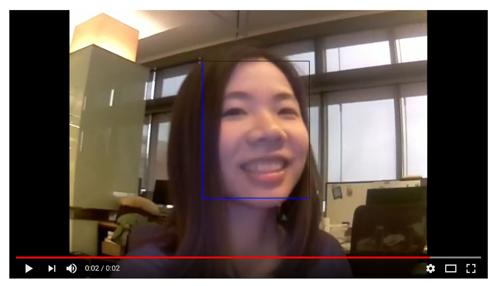
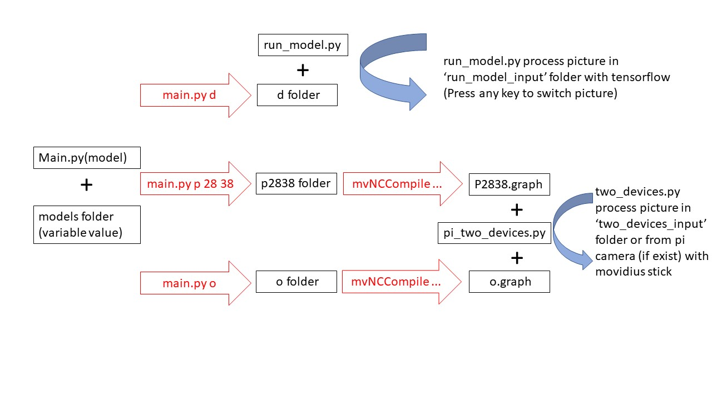
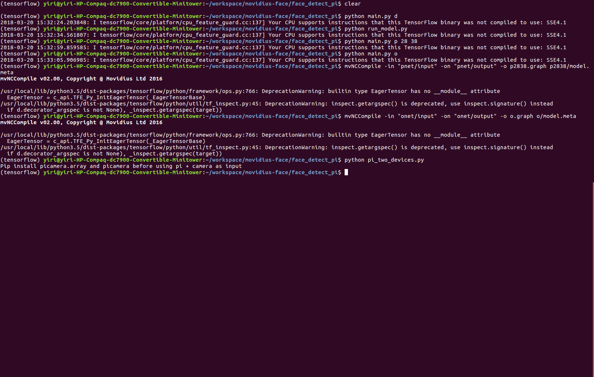

# Movidius Face Detection

## Demo video
[](https://www.youtube.com/watch?v=RGW5E_IfAfY)


About movidius: https://developer.movidius.com/

## Raspberry Pi Steps

### Step1: Set up (PI + one Movidius stick)
(Skip caffe compared with offical document https://developer.movidius.com/start)

1. Install vim and opencv:
```
sudo apt-get install vim
sudo apt-get install python-opencv
```

2. Create workspace folder: 
```
cd /home/pi
mkdir -p workspace
cd workspace
```

3. Clone ncsdk from movidius: 
```
git clone https://github.com/movidius/ncsdk.git
cd ncsdk
```

4. Use vim or other editor to remove line "./install-ncsdk.sh" in file install.sh (about line 40).

5. Run install script: 
```
./install.sh
```

6. Change folder: 
```
cd /opt/movidius/NCSDK
```

7. Use vim or other editor to remove line "check_and_install_caffe" in file install-ncsdk.sh (about line 535).

8. Run script (takes about thirty minutes):
```
./install-ncsdk.sh
```  

9. Run example: 
```
cd /home/pi/workspace/ncsdk/examples/tensorflow/inception_v1
python run.py
```

### Step2: Our sample (PI + camera + two Movidius sticks)

1. Use "sudo raspi-config" choose "interface option -> camera" to enable camera and then reboot
2. Clone our repo:
```
cd /home/pi/workspace 
git clone https://github.com/ihere1/movidius-face
```
3. Run (Enter 'q' in video window to exit program):
```
cd movidius-face/face_detect_pi/
python pi_two_devices.py
```


## Ubuntu Steps

### Step1: Set up (Ubuntu + one Movidius stick)

Follow https://developer.movidius.com/start install packages needed on your Ubuntu and RPI3.

### Step2: Run our sample (Ubuntu + two Movidius stick)

1. On Windows / Ubuntu machine with tensorflow, you can run **python run_model.py** to process pictures in **run_model_input** folder. Press any key to switch picture.
2. On Linux with two sticks, you can run **pi_two_devices.py** to process pictures in **two_devices_input** folder. Press any key to switch picture.

## More details:
Files in face_detect_pi folder:


Commands on Ubuntu to generate checkpoint folders and graph files:
